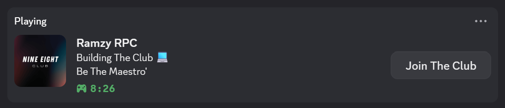

# Ramzy RPC (Discord Rich Presence)

A lightweight custom Discord Rich Presence made in Node.js, designed to run automatically when your computer starts.

## 🌟 Features

- Custom status with image and button
- Runs silently on Windows startup
- Built with `discord-rpc` and automated via `.bat` and `.vbs`

## 🚀 How It Works

1. `rpc.js` — Main script to set your Discord Rich Presence.
2. `start-rpc.bat` — Launches the script with Node.
3. `silent-start.vbs` — Silently runs the `.bat` on Windows startup.

## 🔧 Setup Instructions

1. Clone this repo
2. Run `npm install` to install dependencies
3. Edit `rpc.js` with your own Discord App ID and image key
4. Optionally set the `.vbs` file into your Windows Startup folder:
5. Set it to run on startup (Optional): Copy silent-start.vbs to this folder C:\Users\<YourUsername>\AppData\Roaming\Microsoft\Windows\Start Menu\Programs\Startup

## 💻 Example

## 📁 Tech Stack

- Node.js
- Discord RPC API
- Windows Automation (Batch, VBScript)

## 🧠 Author

Made by Rameen Burdabar - Aspiring Software Engineering student at Sheffield Hallam University  
Feel free to reach out or fork the project!
